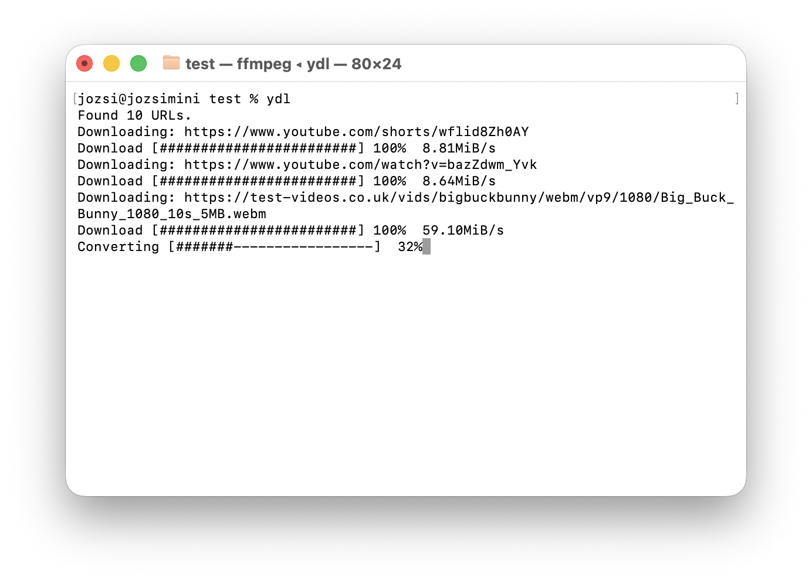

# ydl

`ydl` is a small zsh wrapper around `yt-dlp` for downloading video with a
preference for Apple-friendly H.264/H.265 output. Videos outside that codec
family are converted to H.264 MP4.

`ydl` is built for a macOS workflow, with Apple-friendly video output and
clipboard behavior.



## Install

Install `ydl` and its Homebrew dependencies with one command:

```sh
/bin/zsh -c "$(curl -fsSL https://raw.githubusercontent.com/angelday/ydl/main/install.zsh)"
```

The installer checks for `yt-dlp`, `ffmpeg`, and `ffprobe`. Missing dependencies
are installed with Homebrew. If Homebrew is not installed, the installer will
ask you to install it from <https://brew.sh/> and run the command again. On
non-macOS systems, the installer refuses to run.

By default this installs `ydl` to Homebrew's `bin` directory, such as
`/opt/homebrew/bin/ydl` or `/usr/local/bin/ydl`.

To choose a different install directory:

```sh
YDL_BINDIR="$HOME/bin" /bin/zsh -c "$(curl -fsSL https://raw.githubusercontent.com/angelday/ydl/main/install.zsh)"
```

## Update

Rerun the install command later to update `ydl`. The installer always downloads
the current script and replaces the installed command.

## Usage

Download a URL:

```sh
ydl "https://example.com/video"
```

Download URLs from pasted clipboard text:

```sh
ydl
```

Use browser cookies when a site needs them:

```sh
ydl -c "https://www.instagram.com/reel/..."
ydl -c safari "https://www.instagram.com/reel/..."
ydl -c chrome "https://www.instagram.com/reel/..."
```

`-c` defaults to Safari.

Show backend output:

```sh
ydl -v "https://example.com/video"
```

## Motivation

This project began as a macOS-focused command alias:

```sh
alias ydl='yt-dlp --user-agent="$USERAGENT" -f "(bestvideo[vcodec~='\''^((he|a)vc|h26[45])'\'']+bestaudio[ext=m4a])/(bestvideo+bestaudio/best)" --external-downloader-args "ffmpeg:-movflags faststart" --postprocessor-args "ffmpeg:-movflags faststart" --xattrs --concurrent-fragments 6'
```

It has since grown into a small, durable wrapper around that original workflow.

## Development

The editable source lives in this repository:

```sh
./ydl -h
make test
```

The tests use temporary stub versions of `yt-dlp`, `ffprobe`, `ffmpeg`, and
installer dependencies, so they do not download anything, install packages, or
need network access.

Put reusable input fixtures in `testdata/`. Real downloaded files and other
manual scratch output belong in `manual-test/`, which is ignored by git except
for its `.gitkeep`.

Reusable pasted-note fixtures live in `testdata/`:

- `notes-single.txt`
- `notes-multiple.txt`
- `notes-messy.txt`
- `notes-x.txt`
- `notes-sm.txt`
- `urls.txt`

Use `manual-test/` as the ignored scratch directory for real downloads:

```sh
cd manual-test
../ydl "$(cat ../testdata/notes-x.txt)"
```

From a checked-out development copy, deploy the local script to the command
location:

```sh
make install
```

Compare the development copy with the installed copy:

```sh
make diff-installed
```

By default `make install` installs to `/usr/local/bin/ydl`. Override `PREFIX`,
`BINDIR`, or `BIN` if needed:

```sh
make install BINDIR="$HOME/bin"
```

## License

MIT License. You can use, copy, modify, and share `ydl`,
including in your own projects. Keep the copyright/license notice, and the
software is provided without warranty.
